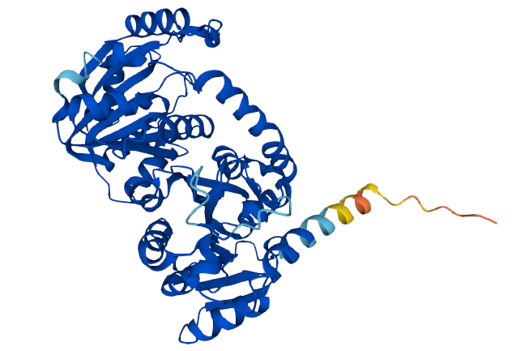
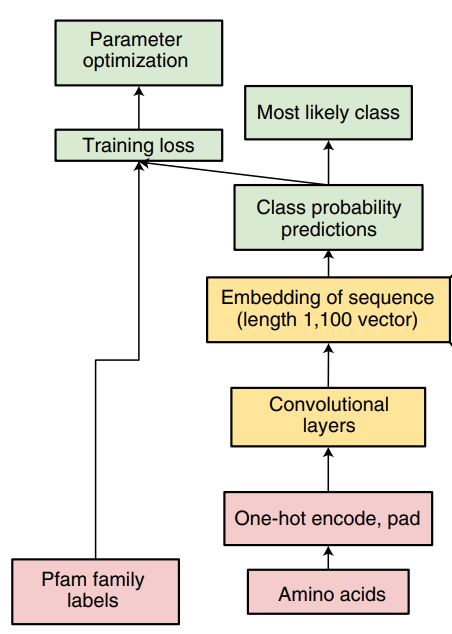
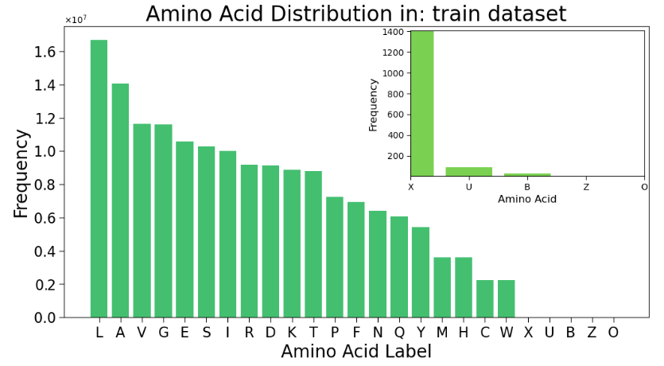

# Classify the universe proteome
## Overview
This project aims to develop a Convolutional Neural Network (CNN) model for the classification of proteome variety. The CNN model is trained on the Pfam dataset and the goal is to accurately classify the input data into different categories or classes. Below the PMT1_CAEEL, an exponent of the Methyltransf_25 class annotated in Pfam.

## Features
- Utilizes a Convolutional Neural Network (CNN) architecture for classification tasks.
- Implements techniques such as data preprocessing, augmentation, and validation to enhance model performance.
- Offers flexibility to customize the CNN architecture, including the number of convolutional layers, pooling layers, and dense layers.
- Supports integration with popular machine learning frameworks like TensorFlow and Keras.

  

## Usage
To use the CNN model:

- Install the required dependencies and libraries specified in the requirements.txt file using conda.
- Download the dataset
- Modify the CNN architecture and hyperparameters as needed in the provided code.
- Train the CNN model on your dataset using the fit function, specifying the training data and validation data.
- Evaluate the model's performance using metrics such as accuracy and loss.
- Make predictions on new, unseen data using the trained model.

## To be implemented 
- Probability distribution for categorical labelling

